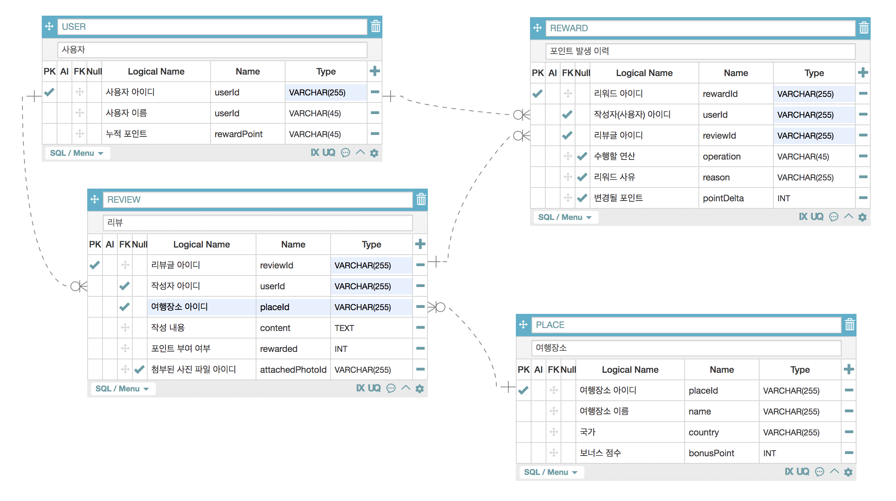

## 클럽 마일리지 서비스

> 포인트 적립 / 포인트 조회 REST API

<br/>

### API 데모

<!-- [](https://www.youtube.com/watch?v=GX_3A7YiRZw?t=0s) -->

<br/>

**목차**

프로그램 작동법

구현 내용 (coverage of implementation)

데이터베이스 스키마 (database scheme)

설계상 주안점(design focus)

<br/>

### 1. 프로그램 작동법

<br/>

🚀 &nbsp; **_macOS_** :

_$ git clone https://github.com/portfolio-y0711/reward_springboot_

_$ cd reward_springboot_

_$ mvn package_

_$ java -jar demo-0.0.1-SNAPSHOT.jar --server.port=8080_

<br/>

☔ ️&nbsp; **_테스트 코드 실행_** :

- 유닛 테스트 / 통합 테스트 / 시나리오 테스트: $ mvn test

<br/>

### 2. 구현 내용

<br/>

💻 &nbsp; **사용한 주요 언어 및 기술** :

- java 1.8 (runtime)
- Spring Web (server application)
- Spring Data JPA (database adaptor)
- Spring QueryDSL (Domain Specific Language for JPQL)
- Cucumber (test specification tools)
- Logback (as applicaiton logger)
- H2 (database)
- Swagger (OpenAPI Documentation Tools)

💻 &nbsp; **구현한 기능** :

- /events 리뷰 추가|변경|삭제 이벤트 처리 엔드포인트

  - 트랜잭션 처리

  - Context Error / Validation Error 처리 (리뷰 중복)

  - HTTP Request 로그 + Application 로그

- /users/{userId}/rewardPoint 사용자의 현재 포인트 총계

- /users/{userId}/rewards 사용자의 포인트 누적 이력

<br/>

### 3. 데이터베이스 스키마

<br/>



<!--
<br/>

🏗 &nbsp; **_DDL Script_** :

```sql
# PLACES(장소)

CREATE TABLE IF NOT EXISTS

    PLACES (
      placeId VARCHAR PRIMARY KEY,
      country VARCHAR NOT NULL,
      name VARCHAR NOT NULL,
      bonusPoint INTEGER NOT NULL,
      timestamp DATETIME DEFAULT CURRENT_TIMESTAMP NOT NULL

) WITHOUT ROWID;

CREATE INDEX IF NOT EXISTS index_places_country ON PLACES(country);
CREATE INDEX IF NOT EXISTS index_places_name ON PLACES(name);
CREATE INDEX IF NOT EXISTS index_places_country_name ON PLACES(country,name);

# USERS(사용자)

CREATE TABLE IF NOT EXISTS

    USERS (
      userId VARCHAR PRIMARY KEY,
      name VARCHAR NOT NULL,
      rewardPoint INTEGER NOT NULL,
      timestamp DATETIME DEFAULT CURRENT_TIMESTAMP NOT NULL
    ) WITHOUT ROWID;

CREATE INDEX IF NOT EXISTS index_users_name ON users(name);

# REVIEWS(사용자 작성 리뷰)

CREATE TABLE IF NOT EXISTS

    REVIEWS (
      reviewId VARCHAR PRIMARY KEY,
      placeId INTEGER,
      content VARCHAR NOT NULL,
      attachedPhotoIds VARCHAR NOT NULL,
      userId INTEGER,
      rewarded INTEGER NOT NULL,
      timestamp DATETIME DEFAULT CURRENT_TIMESTAMP NOT NULL,

      CONSTRAINT fk_places
      FOREIGN KEY (placeId)
      REFERENCES PLACES (id)

      CONSTRAINT fk_users
      FOREIGN KEY (userId)
      REFERENCES USERS (id)
    ) WITHOUT ROWID;

CREATE INDEX IF NOT EXISTS index_reviews_rewarded ON REVIEWS(rewarded);

# REWARDS(포인트 적립 기록)

CREATE TABLE IF NOT EXISTS

    REWARDS (
      rewardId VARCHAR PRIMARY KEY,
      userId VARCHAR,
      reviewId VARCHAR,
      operation VARCHAR NOT NULL,
      pointDelta INTEGER NOT NULL,
      reason VARCHAR NOT NULL,
      timestamp DATETIME DEFAULT CURRENT_TIMESTAMP NOT NULL,

      CONSTRAINT fk_users_rewards_users
      FOREIGN KEY (userId)
      REFERENCES USERS (id)

    ) WITHOUT ROWID;

CREATE INDEX IF NOT EXISTS index_rewards_reason ON REWARDS(reason);
```
-->

### 4. 설계상 주안점, 워크플로우

<br/>

🎯 &nbsp; **_Open Closed Principle_** : 이벤트 타입, 액션에 따른 전략 객체 생성을 통한 이벤트 처리 알고리즘 변경 / 라우팅 테이블 주입 및 라우팅 처리 (Event Router / Action Router)로 유연한 설계 구현

<br/>

**_⌘ 관련 코드_**

_이벤트 핸들링 서비스_: [`src/main/java/com/portfolioy0711/api/services`](https://github.com/portfolio-y0711/reward_springboot/tree/main/src/main/java/com/portfolioy0711/api/services)

```ts
// 이벤트 타입으로 분기 ("REVIEW")
@Service
public class EventService {

  @Autowired
  private ApplicationContext context;


  public void route (String eventStr) throws ParseException, JsonProcessingException {
      JSONParser jsonParser = new JSONParser();
      JSONObject jsonObject = (JSONObject) jsonParser.parse(eventStr);
      ObjectMapper objectMapper = new ObjectMapper();

      if (jsonObject.containsKey("type") && jsonObject.containsKey("action")) {
          String type = (String) jsonObject.get("type");
          switch(type) {
              case "REVIEW":
                  ReviewEventDto reviewEvent = (ReviewEventDto) objectMapper.readValue(eventStr, new TypeReference<ReviewEventDto>(){});
                  ReviewEventHandler reviewEventHandler = context.getBean(ReviewEventHandler.class);
                  reviewEventHandler.route(reviewEvent);
                  break;
              case "BlarBlar":
                  BlarBlarEventDto blarblarEvent = (BlarBlarEventDto) objectMapper.readValue(eventStr, new TypeReference<BlarBlarEventDto>(){});
                  BlarBlarEventHandler blarblarEventHandler = context.getBean(BlarBlarEventHandler.class);
                  blarblarEventHandler.route(blarblarEvent);
                  break;
          }
      }
  }
}


// 액션 타입으로 분기 ("ADD", "MOD", "DELETE")
@Component
public class ReviewEventHandler implements EventHandler {
  @Autowired
  private ApplicationContext context;

  private Map<String, ActionHandler> routes = new HashMap<>();

  public ReviewEventHandler(ApplicationContext context) {
      this.context = context;
      this.routes.put("ADD", (ActionHandler) context.getBean(AddReviewActionHandler.class));
      this.routes.put("MOD", (ActionHandler) context.getBean(ModReviewActionHandler.class));
      this.routes.put("DEL", (ActionHandler) context.getBean(DelReviewActionHandler.class));
  }

  public void route (Object event) {
      String action = ((ReviewEventDto) event).getAction();
      routes.get(action).handleEvent(event);
  }
}

```

<br/>

<br/>

🎯 &nbsp; **_BDD / TDD driven_** : 유닛 테스트 코드로 scaffolding 한 이후, 통합 테스트와 함께 구현체를 작성해 나가는 테스트 주도 개발 워크플로우 사용

<br/>

**_⌘ 관련 코드_**

_유닛 테스트_: [`src/test/java/com/portfolioy0711.api/_unit`](https://github.com/portfolio-y0711/reward_springboot/tree/main/src/test/java/com/portfolioy0711/api/_unit)

_통합 테스트_: [`src/test/java/com/portfolioy0711.api/_i11`](https://github.com/portfolio-y0711/reward_springboot/tree/main/src/test/java/com/portfolioy0711/api/_i11)

_시나리오 테스트_: [`src/test/java/com/portfolioy0711.api/_usecase`](https://github.com/portfolio-y0711/reward_springboot/tree/main/src/test/java/com/portfolioy0711/api/_usecase)

<br/>
